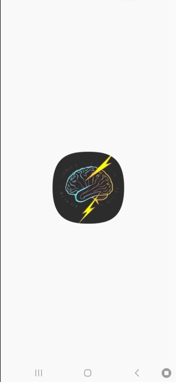

<h1 align="center">NúmerosFlash</h1>

 <em>Recuerda, calcula... y ¡gana en un flash!</em> 

  
  

---

## 🧠 ¿De qué trata NúmerosFlash?

**NúmerosFlash** es un juego de agilidad mental que te reta a sumar o restar números que aparecen brevemente en pantalla. Memorízalos, realiza las operaciones y da tu respuesta al final.

### 🎯 Objetivo
Suma (o resta) correctamente todos los números que van apareciendo en pantalla uno por uno. ¡Cada segundo cuenta!

---

## ⚙️ Características principales

- 👤 **Modo solitario**: práctica y mejora tu cálculo mental.
- ⏱️ **Diferentes dificultades con niveles**: Mientras vaya aumentando el nivel mayor rango y cantidad de operaciones
  - Principiante: Tiempo 8 s
  - Desafío Rápido: Tiempo 5 s
  - Relámpago: Tiempo 3 s
  - Flash: 1 s
- 📈 **Estadísticas del jugador**: revisa tu progreso y mejora tu tiempo y precisión.
- 🎮 **Interfaz fluida y moderna** usando **Jetpack Compose**.

---

## 🧪 Tecnologías y herramientas utilizadas

<table>
  <tr>
    <th>Tecnología</th>
    <th>Descripción</th>
  </tr>
  <tr>
    <td align="center">
      
      <strong align="center">Kotlin</strong>
    </td>
    <td>Lenguaje principal de desarrollo</td>
  </tr>
  <tr>
    <td align="center">
      
      <strong align="center">Jetpack Compose</strong>
    </td>
    <td>UI moderna y declarativa de Android</td>
  </tr>
  <tr>
    <td align="center">
      
      <strong align="center">Firebase</strong>
    </td>
    <td>Autenticación, base de datos en tiempo real y estadísticas</td>
  </tr>
  <tr>
    <td align="center">
      
      <strong align="center">Pixabay</strong>
    </td>
    <td>Música y efectos de sonido</td>
  </tr>
</table>

---

## 🖼️ Capturas de pantalla

  
  
  
  
  
  
  

## Vídeo Demo

## Diseño

[Diseño figma](https://www.figma.com/design/QLWcmwfSmM4ncZ6VChTqNn/NumerosFlash?node-id=0-1&t=dF7cjJljrQM58co2-1)

---

## 📲 Descargar

**¡Disponible en Google Play!**  
📦 [NúmerosFlash](https://play.google.com/store/apps/details?id=co.edu.upb.numerosflash)

---

## 🚧 Estado del proyecto

- [x] Diseño de pantallas
- [x] Modo solitario funcional
- [x] Publicación en Play Store
- [ ] Modo Multijugador

---

Desarrollado por Ivan Tang Zhu

